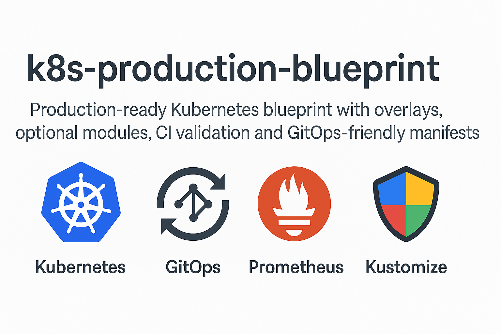

<p align="center">
  
</p>

# k8s-production-blueprint

[](https://github.com/shizznet/k8s-production-blueprint/actions/workflows/validate-manifests.yaml)

A production-grade Kubernetes platform blueprint built for GitOps, security, and modular deployment.  
This repository provides:

- **Kustomize overlays** (`dev`, `prod`)
- **FluxCD GitOps deployment**
- **SOPS + AWS KMS** secret encryption
- **Terraform EKS infrastructure bootstrap**
- **Optional modules** (Ingress, NetworkPolicy, Monitoring, AWS Load Balancer)
- **Local development workflow via Kind**

---

# 🚀 Quick Start — Full Production Bootstrap

## 1. Provision EKS with Terraform
```bash
cd eks/terraform
terraform init
terraform apply
```

Set kubeconfig:
```bash
aws eks update-kubeconfig   --region ap-south-1   --name k8s-production-cluster
```

---

## 2. Bootstrap GitOps (FluxCD)
```bash
flux bootstrap github   --owner=shizznet   --repository=k8s-production-blueprint   --branch=main   --path=gitops/flux/flux-system
```

Flux now manages:
- `k8s/overlays/dev`
- `k8s/overlays/prod`

---

## 3. Manage Secrets with SOPS + AWS KMS

1. Edit your secret template:
```
k8s/secrets/appsecret.template.yaml
```

2. Encrypt it:
```bash
./tools/encrypt-secret.sh   k8s/secrets/appsecret.template.yaml   k8s/secrets/appsecret.enc.yaml
```

---

## 4. Deploy Workloads Manually (Optional)

### Production:
```bash
kustomize build k8s/overlays/prod | kubectl apply -f -
```

### Development:
```bash
kustomize build k8s/overlays/dev | kubectl apply -f -
```

---

# 📦 Optional Production Modules

| Module | Path | Purpose |
|--------|------|----------|
| Ingress + TLS | `k8s/optional/ingress` | cert-manager + ingress-nginx |
| AWS Load Balancer | `k8s/optional/loadbalancer` | NLB-backed ingress |
| Network Policies | `k8s/optional/networkpolicy` | Default-deny + allow rules |
| Monitoring Stack | `k8s/optional/monitoring` | Dashboards & Prometheus annotations |

Enable via Kustomize overlay:
```yaml
resources:
  - ../../optional/<module>
```

---

# 🧱 Repository Layout

```
k8s/
  base/
  overlays/
  optional/
  secrets/

gitops/
  flux/

eks/
  terraform/

tools/
  create-kind-cluster.sh
  encrypt-secret.sh
```

---

# 🧪 Local Development (Kind)
```bash
./tools/create-kind-cluster.sh
kubectl apply -f https://raw.githubusercontent.com/kubernetes/ingress-nginx/main/deploy/static/provider/kind/deploy.yaml
```

---

# 🤝 Contributing
See `.github/CONTRIBUTING.md`

---

# 🔐 Security
- No plaintext secrets allowed  
- All secrets must be SOPS-encrypted using AWS KMS  

---

# 📘 License
MIT
